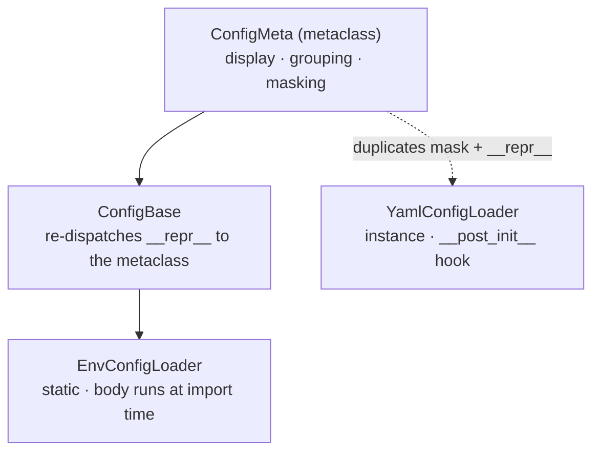

<div align="center">

# ConfigPlusPlus

### CONFIG, MADE LEGIBLE

**Typed configuration for Python** — load it from environment variables or YAML, display it
grouped and readable, and mask secrets automatically. A small, dependency-light library meant
to be shared across every service in a stack.

[](https://pypi.org/project/configplusplus/)
[](https://pypi.org/project/configplusplus/)
[](https://github.com/Florian-BARRE/ConfigPlusPlus/actions/workflows/ci.yml)
[](https://github.com/Florian-BARRE/ConfigPlusPlus/actions/workflows/codeql.yml)
[](LICENSE)

</div>

> Declare a config class, read each field with `env(...)` or from a YAML file, and `print` it.
> You get a grouped, aligned, secret-masked view of exactly what your service is running with —
> the same on the class and on an instance.

---

### Why ConfigPlusPlus

- **One obvious place for configuration.** A config is a class; every `UPPERCASE` attribute is a
  field. No scattered `os.getenv` calls, no untyped dictionaries.
- **Readable by default.** `print(MyConfig)` renders a boxed, prefix-grouped, aligned view — on
  the class itself, no instance required.
- **Secrets never leak into logs.** Fields whose name contains `SECRET`, `API_KEY`, `PASSWORD`,
  `TOKEN` or `CREDENTIAL` are masked automatically, everywhere the config is displayed.
- **Typed, with a precise casting contract.** `env(..., cast=int|bool|float|pathlib.Path)` with a
  documented, stable boolean rule — the same across every service that depends on it.

---

### Installation

```bash
pip install configplusplus
# or
poetry add configplusplus
```

Requires Python 3.10+.

---

### Quickstart

```python
from configplusplus import EnvConfigLoader, env
import pathlib

class AppConfig(EnvConfigLoader):
    DATABASE_HOST = env("DATABASE_HOST")                       # required (raises if missing)
    DATABASE_PORT = env("DATABASE_PORT", cast=int)             # typed
    DATA_DIR      = env("DATA_DIR", cast=pathlib.Path)         # pathlib.Path
    DEBUG_MODE    = env("DEBUG_MODE", cast=bool, default=False)  # optional with default
    SECRET_API_KEY = env("SECRET_API_KEY")                     # masked on display

print(AppConfig.DATABASE_HOST)   # -> 'localhost'
print(AppConfig)                 # -> grouped, aligned, masked view
```

`print(AppConfig)` renders:

```text
╔════════════════════════════════════════════╗
║                 APPCONFIG                  ║
╚════════════════════════════════════════════╝

▶ API
    API_ENDPOINT = 'https://api.example.com'
    API_KEY      = 'key…56 (hidden)'

▶ DATABASE
    DATABASE_HOST = 'localhost'
    DATABASE_PORT = 5432

▶ DEBUG
    DEBUG_MODE = False

▶ SECRET
    SECRET_JWT_KEY = 'sk_…89 (hidden)'
```

Only `UPPERCASE`, non-callable attributes are part of a config. Fields are grouped by the prefix
before the first underscore (`DATABASE_HOST` + `DATABASE_PORT` → **DATABASE**).

> `EnvConfigLoader` bodies are evaluated **at import time** — the environment must already be
> populated when the class is defined. Load your `.env` before importing the config (see below).

---

### The `env()` casting contract

```python
env(key: str, *, default=None, cast=str, required=True)
```

| Argument   | Default | Behaviour                                                        |
|------------|---------|------------------------------------------------------------------|
| `cast`     | `str`   | `int`, `float`, `bool`, `pathlib.Path`, or any 1-arg callable    |
| `default`  | `None`  | Returned when the variable is unset                              |
| `required` | `True`  | Raise `RuntimeError` if unset **and** no default is provided     |

`env_optional(key, *, default=None, cast=str)` is the shorthand for `required=False`.
`env_list(key, *, default=None, sep=",", cast=str, required=True)` reads a delimited value as
a list (`"a, b ,c"` → `["a", "b", "c"]`; `cast=int` on `"80,443"` → `[80, 443]`).

**Boolean casting** (`cast=bool`) — these strings are `False`; everything else is `True`:

```text
"false"  "False"  "FALSE"  "0"  "no"  "No"  "NO"  ""
```

---

### Loading `.env` files

```python
from configplusplus import safe_load_envs

safe_load_envs()                 # load ./.env  (default)
safe_load_envs(".env")           # explicit file
safe_load_envs("config/.env")    # nested file
safe_load_envs("./config")       # a directory: loads every *.env inside it
safe_load_envs(verbose=False)    # silent

# Typical entrypoint: load the environment BEFORE importing config classes.
```

Returns `True` if at least one file was loaded, `False` otherwise. Accepts a `str` or a
`pathlib.Path`, a single `*.env` file or a directory of them.

---

### YAML configuration

```python
from configplusplus import YamlConfigLoader

class UiConfig(YamlConfigLoader):
    def __post_init__(self) -> None:
        self.app_name = self._raw_config["application"]["name"]
        self.theme    = self._raw_config["display"]["theme"]

config = UiConfig("config.yaml")

config.get("database.host")            # dot-notation access
config.get("api.timeout", default=30)  # with a fallback
config.has("database.host")            # membership test
config.to_dict()                       # plain dict
print(config)                          # same grouped, masked display
```

Unlike `EnvConfigLoader`, `YamlConfigLoader` is **instantiated** with a path and runs a
`__post_init__` hook where you shape the raw YAML into typed attributes.

---

### Secret masking

Masking is a safety feature, applied wherever a config is displayed. A field is masked when its
name contains any of:

```text
SECRET   API_KEY   PASSWORD   TOKEN   CREDENTIAL
```

```python
SECRET_API_KEY = "sk_live_abc123xyz789"   # shown as 'sk_…89 (hidden)'
PASSWORD       = "short"                   # shown as '***hidden***'   (≤ 6 chars)
```

Masking applies to the display. `to_dict()` returns **raw** values (so you can read them);
use `to_dict(mask=True)` when logging the whole config. Extend the keyword set per class
(extend only, never narrow):

```python
class MyConfig(EnvConfigLoader):
    _sensitive_keywords = EnvConfigLoader._sensitive_keywords + ("PRIVATE_KEY",)
```

---

### Custom validation

```python
class APIConfig(EnvConfigLoader):
    PORT = env("PORT", cast=int, default=8000)

    @classmethod
    def validate(cls) -> None:
        super().validate()               # always call super().validate()
        if not (1024 <= cls.PORT <= 65535):
            raise RuntimeError("PORT out of range")

APIConfig.validate()
```

---

### Architecture



The display lives on the **metaclass**, which is why `print(MyConfig)` works on the class with no
instance. `YamlConfigLoader` intentionally re-implements masking so it can display instances the
same way.

---

### Public API

| Symbol             | Kind      | Purpose                                                        |
|--------------------|-----------|----------------------------------------------------------------|
| `EnvConfigLoader`  | class     | Static, class-based config read from environment variables     |
| `YamlConfigLoader` | class     | Instance-based config read from a YAML file                    |
| `ConfigBase`       | class     | Base for custom loaders; delegates display to `ConfigMeta`     |
| `ConfigMeta`       | metaclass | Owns `to_dict`, grouping and masking                           |
| `env`              | function  | Read one variable with casting / default / required            |
| `env_optional`     | function  | `env(..., required=False)` shorthand                           |
| `env_list`         | function  | Read a delimited variable as a typed list                      |
| `safe_load_envs`   | function  | Load `.env` file(s) from a path or directory, with logging     |

The package ships a PEP 561 `py.typed` marker — its type hints are visible to downstream
type-checkers.

---

### Documentation

| Guide                              | Contents                                        |
|------------------------------------|-------------------------------------------------|
| [Installation](docs/INSTALL.md)    | Install options and requirements                |
| [Usage](docs/USAGE.md)             | Full walkthrough of every feature               |
| [Reference](docs/REFERENCE.md)     | Concise API cheat-sheet                         |
| [`examples/`](examples/)           | Runnable end-to-end scripts                     |

---

### Project layout

```text
src/configplusplus/
├── __init__.py       public API + __all__
├── base.py           ConfigMeta (display, grouping, masking) + ConfigBase
├── env_loader.py     EnvConfigLoader — static, import-time evaluation
├── yaml_loader.py    YamlConfigLoader — instance, __post_init__, dot-notation get()
└── utils.py          env() · env_optional() · safe_load_envs()
```

---

### Development

```bash
poetry install                                   # editable install (src layout)
poetry run pytest                                # tests + coverage
poetry run black src/ tests/ examples/           # formatting (checked in CI)
poetry run ruff check src/ tests/ examples/      # linting
poetry run mypy src/                             # type checking
```

Releases are automated. Commit with [Conventional Commits](https://www.conventionalcommits.org)
(`fix:`, `feat:`, `feat!:`); merging to `main` lets **release-please** open a version-bump PR,
and merging that PR tags the release and publishes to PyPI via Trusted Publishing (OIDC).

---

### License

[MIT](LICENSE) © Florian BARRE
